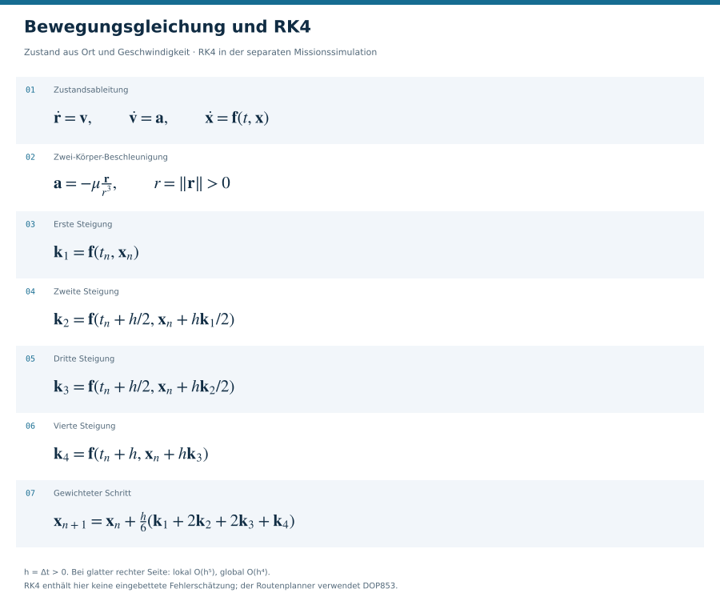
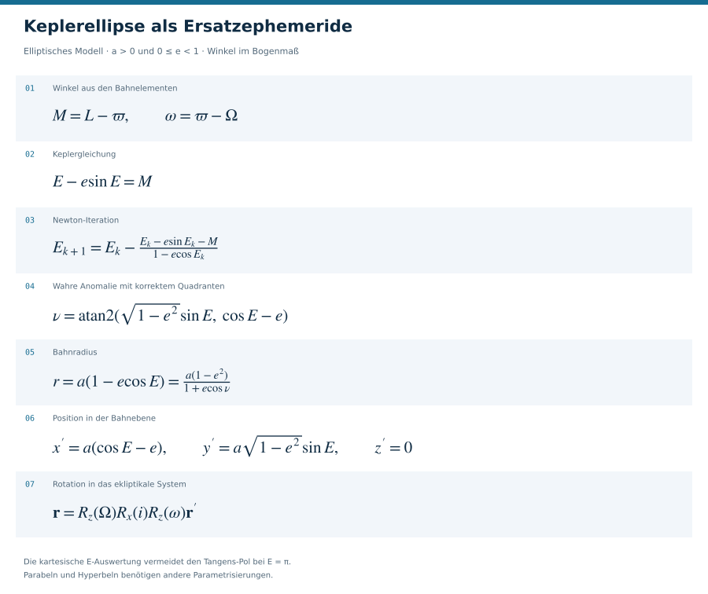
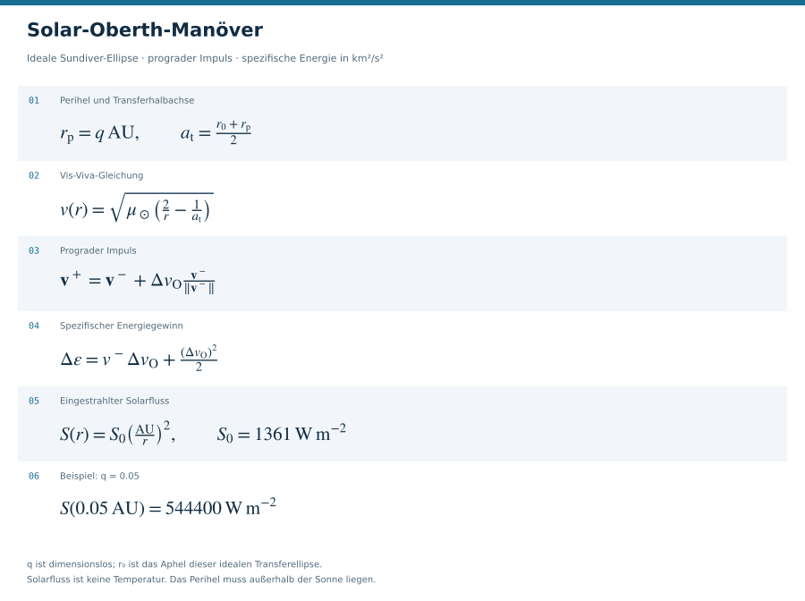
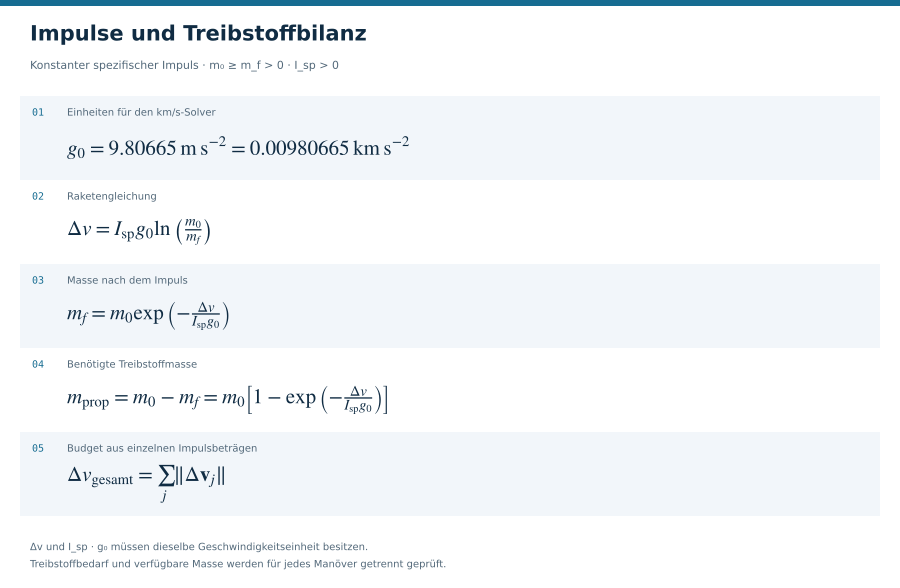
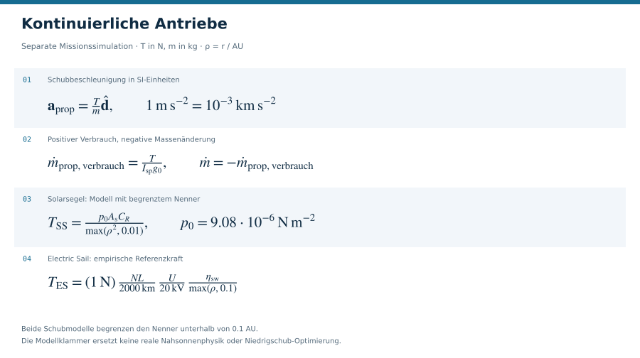
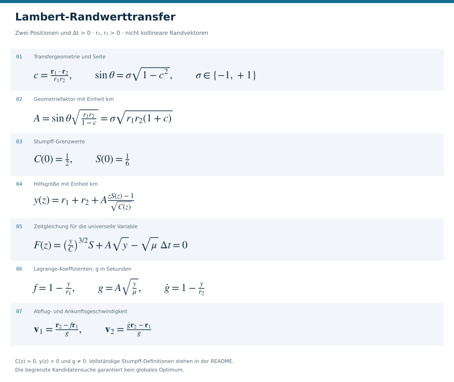
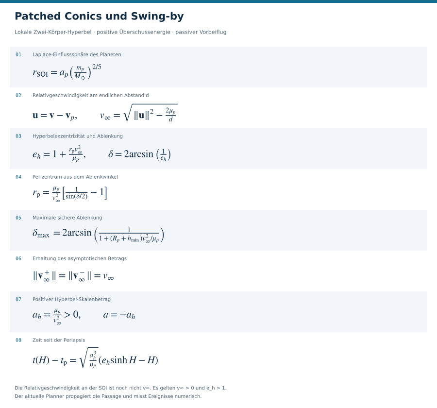
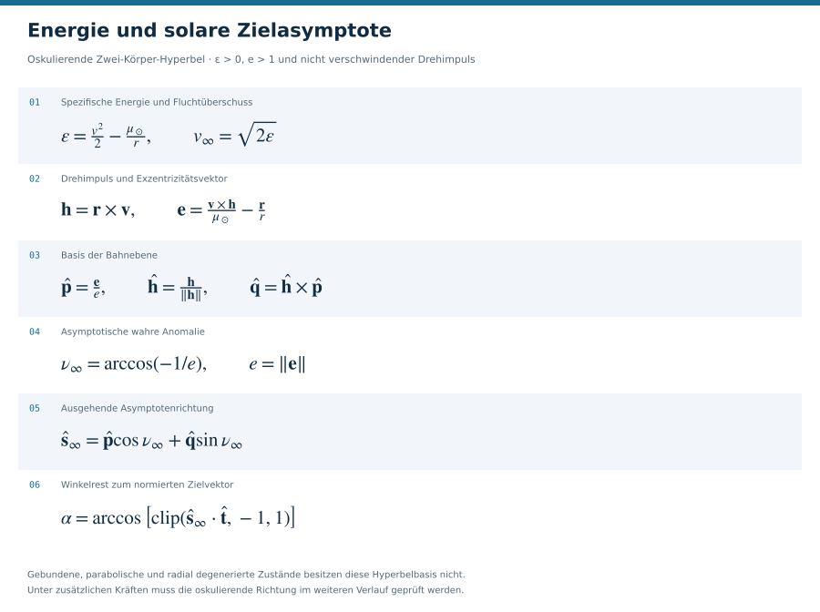

# Solar System Mission Simulator

Lokale Webanwendung zur Planung und Simulation von Raumfahrtmissionen:
Transfers zwischen Sonne, Planeten und natürlichen Monden, Parkorbits,
Swing-bys, Solar-Oberth-Manöver und eine gemeinsame 2D-/3D-Darstellung.
Flask stellt die Python-Rechenkette bereit; React und Three.js bilden die
Oberfläche. Das Projekt befindet sich in aktiver Entwicklung.

Die öffentliche Routenberechnung verwendet den gemeinsamen
`PhysicalRoute`-Planner. Jeder Abschnitt übernimmt den vorherigen Endzustand
mit Position, Geschwindigkeit, Zeitpunkt und Bezugssystem. Manöver und
Massenänderungen werden einzeln ausgewiesen. Eine berechnete Geometrie kann
vorliegen, obwohl die konfigurierte Fahrzeugleistung für ihre Ausführung
nicht ausreicht.


## Inhalt

- [Lokal starten](#lokal-starten)
- [Modellumfang und Ergebnisstatus](#modellumfang-und-ergebnisstatus)
- [Ephemeriden und Konfiguration](#ephemeriden-und-konfiguration)
- [Berechnungen und Formeln](#berechnungen-und-formeln)
- [Architektur, Daten und API](#architektur-daten-und-api)
- [Prüfen und weiterentwickeln](#prüfen-und-weiterentwickeln)
- [Modellgrenzen und Dokumentation](#modellgrenzen-und-dokumentation)

## Lokal starten

Voraussetzungen: Python mit `pip` und Node.js mit `npm`. Der lokal geprüfte
Python-Stand ist **3.13**. Die Python-Paketgrenzen stehen in
[`requirements.txt`](requirements.txt); Python 3.8 ist für diesen Stand
ungeeignet. Der verwendete Vite-Build verlangt Node.js **20.19+ innerhalb
der 20er-Reihe oder 22.12+**. Die Frontend-Versionen werden durch
[`web/package-lock.json`](web/package-lock.json) festgelegt.

Alle folgenden Befehle beginnen im Projektverzeichnis.

**Windows PowerShell:**

```powershell
python -m venv .venv
.\.venv\Scripts\python.exe -m pip install -r requirements.txt
Set-Location web
npm ci
npm run build
Set-Location ..
.\.venv\Scripts\python.exe main.py
```

Eine Aktivierung der virtuellen Umgebung ist für diese Befehle nicht nötig.

**Linux / macOS:**

```bash
python3 -m venv .venv
.venv/bin/python -m pip install -r requirements.txt
cd web
npm ci
npm run build
cd ..
.venv/bin/python main.py
```

Die Anwendung läuft anschließend unter
[http://127.0.0.1:5001/](http://127.0.0.1:5001/).
Flask liefert den Build aus `web/dist/` aus. Nach Änderungen am Frontend
`npm run build` erneut ausführen und die Browserseite neu laden. Ein leeres
Projekt enthält keine Musterroute; über **„+ Neu“** entsteht der erste
Routenabschnitt.

## Modellumfang und Ergebnisstatus

- Gemeinsame Zustandskette für freie Routen, lokale Begegnungen und
  gebundene Orbits; Einfang- und Abflugimpulse gehören zum Gesamtbudget.
- Lambert-Kandidaten für Randwerttransfers und ereignisaufgelöste
  DOP853-Propagation für die eigentliche Bewegung.
- Patched Conics als Standardmodell; optional ein kontinuierliches
  Kraftmodell mit Sonne, Planeten und verfügbaren großen Monden.
- Erde–Mond–Mondorbit–Erde als Missionsvorlage sowie ein endlicher
  Startaufstieg bis zum gemessenen Parkorbit.
- Separate Solar-Oberth-Missionssimulation mit RK4 und modularen
  kontinuierlichen Antrieben. Sie ist ein eigenes Modell; ein Export einer
  geplanten Route übernimmt deren berechnete Zustände.
- Lokale Projektspeicherung, Berechnungsvarianten und Auditspuren.
  Die Anzeige verwendet mitgelieferte Körperzustände an berechneten Ereignissen.

| Ergebnisstatus | Bedeutung im angegebenen Modell |
| --- | --- |
| `model_valid` | Modellprüfungen erfüllt; kein Fahrzeugnachweis konfiguriert |
| `valid` | Modellprüfungen und konfigurierte Fahrzeugressourcen erfüllt |
| `infeasible` | Ein Budget oder eine Ressource reicht für den Entwurf nicht aus |
| `data_unavailable` | Benötigte Ephemeride, exakter Mittelpunkt oder Körperdaten fehlen |
| `no_solution_found` | Im untersuchten Suchraum keine bestätigte Lösung gefunden |

`flightReady` beschreibt die Modell- und Ressourcenprüfung in der Anwendung.
Eine erfolglose begrenzte Suche beweist keine grundsätzliche Unmöglichkeit.

## Ephemeriden und Konfiguration

Das Backend nutzt geometrische SPICE-Zustände in `ECLIPJ2000`, relativ zur
Sonne und ohne Lichtzeit- oder Aberrationskorrektur (`NONE`). Ohne nutzbare
Kernel liefert der Modus `auto` vereinfachte Kepler-Ephemeriden. Eine solche
Näherung bestätigt keine Route, die einen exakten Körpermittelpunkt verlangt.

Der vorhandene Downloader bezieht generische Kernel direkt von NAIF:
`naif0012.tls`, `de440s.bsp`, `gm_de440.tpc` und `pck00011.tpc`.
Für Planetenmittelpunkte und große Monde können Satelliten-SPKs ergänzt werden.

```powershell
.\.venv\Scripts\python.exe scripts/download_spice_kernels.py
# Optional: zusätzlich Satelliten-SPKs herunterladen
.\.venv\Scripts\python.exe scripts/download_spice_kernels.py --satellites
```

Kerneldateien gehören nicht nach Git. Der Downloader schreibt den lokalen
Meta-Kernel `kernels/solar_system.tm` sowie ein Manifest mit Herkunft und
Prüfsummen. Nach dem Download einen laufenden Python-Server neu starten.
`de440s.bsp` liefert für mehrere Planetensysteme nur das Baryzentrum;
Körperzentrum und Systembaryzentrum sind unterschiedliche Zielpunkte.

| Variable | Wirkung |
| --- | --- |
| `SOLAR_SYSTEM_EPHEMERIS=auto` | SPICE verwenden, falls verfügbar; sonst Kepler-Näherung |
| `SOLAR_SYSTEM_EPHEMERIS=spice` | SPICE verbindlich verlangen; fehlende Kernel sind ein Fehler |
| `SOLAR_SYSTEM_EPHEMERIS=kepler` | Vereinfachte Ephemeriden bewusst wählen |
| `SOLAR_SYSTEM_SPICE_METAKERNEL` | Absoluter Pfad zu einem eigenen Meta-Kernel |
| `SOLAR_SYSTEM_STORAGE_DIR` | Basisverzeichnis für Datenbank und Laufzeitprotokolle |
| `SOLAR_SYSTEM_AI_DISABLED=1` | Modellaufrufe sperren; deterministische Berechnungen bleiben verfügbar |

Beispiel für PowerShell vor dem Serverstart:

```powershell
$env:SOLAR_SYSTEM_EPHEMERIS = "spice"
$env:SOLAR_SYSTEM_SPICE_METAKERNEL = "C:\Pfad\zu\mission.tm"
.\.venv\Scripts\python.exe main.py
```

[`GET /api/ephemeris/status`](http://127.0.0.1:5001/api/ephemeris/status)
meldet den aktiven Modus und die aufgelösten Ziele. Die optionale KI-Anbindung
ist in [`docs/README_AI.md`](docs/README_AI.md) beschrieben; die
Bahnberechnung benötigt kein Sprachmodell.

## Berechnungen und Formeln

Die Gleichungen beschreiben jeweils das benannte Teilmodell. Vektoren sind
fett gesetzt, Beträge und skalare Größen nicht. Die kopierbaren LaTeX-Blöcke
werden von Markdown-Renderern mit Mathematikunterstützung dargestellt.
Jeder Abschnitt enthält zusätzlich eine eigenständige SVG-Formelübersicht.

### Größen, Einheiten und Bezugssystem

| Größe | Symbol | Interne Einheit / Bedeutung |
| --- | --- | --- |
| Orts- und Geschwindigkeitsvektor | $\mathbf{r}$, $\mathbf{v}$ | $\mathrm{km}$, $\mathrm{km\,s^{-1}}$ |
| Abstand und Geschwindigkeit | $r=\lVert\mathbf{r}\rVert$, $v=\lVert\mathbf{v}\rVert$ | $\mathrm{km}$, $\mathrm{km\,s^{-1}}$ |
| Zeitintervall | $\Delta t$ | $\mathrm{s}$; ein Tag entspricht $86400\,\mathrm{s}$ |
| Gravitationsparameter | $\mu=GM$ | $\mathrm{km^3\,s^{-2}}$ |
| Impulsänderung / ihr Betrag | $\Delta\mathbf{v}$, $\Delta v=\lVert\Delta\mathbf{v}\rVert$ | $\mathrm{km\,s^{-1}}$ |
| Raumfahrzeugmasse / Schub | $m$, $T$ | $\mathrm{kg}$, $\mathrm{N}$ |
| Spezifischer Impuls | $I_{\mathrm{sp}}$ | $\mathrm{s}$ |
| Bahnelemente | $a,e,i,\Omega,\omega,M$ | Halbachse, Exzentrizität, Inklination, Knotenlänge, Periapsisargument, mittlere Anomalie |

$\hat{\mathbf{r}}=\mathbf{r}/r$ ist radial;
$\hat{\mathbf{v}}=\mathbf{v}/v$ zeigt in Bewegungsrichtung. Diese Richtung
ist bei einer Bahn mit radialer Geschwindigkeitskomponente keine rein
transversale Richtung. Einheitsvektoren setzen eine positive Vektornorm voraus.
Formeln verwenden Winkel im Bogenmaß; API-Felder mit dem Suffix `Deg` verwenden Grad.

| Konstante | Wert | Implementierung |
| --- | --- | --- |
| Astronomische Einheit | $1\,\mathrm{AU}=149597870.7\,\mathrm{km}$ | `solver/trajectory.py::AU_KM` |
| Sonnen-GM | $\mu_\odot=1.32712440018\cdot10^{11}\,\mathrm{km^3\,s^{-2}}$ | `solver/trajectory.py::MU_SUN` |
| Erd-GM im Missionsmodell | $\mu_\oplus=398600.4418\,\mathrm{km^3\,s^{-2}}$ | `solver/trajectory.py::MU_EARTH` |
| Erdradius im Missionsmodell | $R_\oplus=6378.137\,\mathrm{km}$ | `solver/trajectory.py::EARTH_RADIUS_KM` |
| Solarfluss bei 1 AU | $S_0=1361\,\mathrm{W\,m^{-2}}$ | `solver/trajectory.py::SOLAR_CONSTANT_W_M2` |
| Normfallbeschleunigung | $g_0=9.80665\,\mathrm{m\,s^{-2}}=0.00980665\,\mathrm{km\,s^{-2}}$ | `models/propulsion.py`, `solver/orbital.py` |

Diese Konstanten sind Modellwerte. Der gemeinsame Routenplanner verwendet
Körperdaten aus dem Katalog beziehungsweise dem SPICE-Provider; das verwendete
GM kann daher vom oben genannten Missionsmodellwert abweichen.

Ein Zustand umfasst zusätzlich UTC-Zeitstempel, Frame und Bezugskörper.
Für die Überführung aus einem körperzentrierten, gleich orientierten
Inertialsystem müssen **beide** Vektoren übersetzt werden:

$$
\begin{aligned}
\mathbf{r}_{\mathrm{helio}}(t)&=\mathbf{r}_p(t)+\mathbf{r}_{\mathrm{rel}}(t),\\
\mathbf{v}_{\mathrm{helio}}(t)&=\mathbf{v}_p(t)+\mathbf{v}_{\mathrm{rel}}(t).
\end{aligned}
$$

Bei anderer Achsenorientierung kommt die passende Zustandstransformation hinzu.
Das Frontend skaliert die Anzeige; diese Skalierung gehört nicht in die Dynamik.

### Bewegungsgleichung und Integration

Der Zustand und seine zeitliche Ableitung lauten:

$$
\mathbf{x}(t)=
\begin{bmatrix}\mathbf{r}(t)\\\mathbf{v}(t)\end{bmatrix},
\qquad
\dot{\mathbf{x}}(t)=
\begin{bmatrix}\mathbf{v}(t)\\\mathbf{a}(t,\mathbf{r},\mathbf{v})\end{bmatrix}
=\mathbf{f}(t,\mathbf{x}).
$$

Im Zwei-Körper-Modell wirkt $\mathbf{a}=-\mu\mathbf{r}/r^3$.
Im kontinuierlichen heliozentrischen Kraftmodell gilt:

$$
\mathbf{a}=
-\mu_\odot\frac{\mathbf{r}}{r^3}
+\sum_{p\in\mathcal{B}}\mu_p
\left[
\frac{\mathbf{r}_p(t)-\mathbf{r}}{\lVert\mathbf{r}_p(t)-\mathbf{r}\rVert^3}
-\frac{\mathbf{r}_p(t)}{\lVert\mathbf{r}_p(t)\rVert^3}
\right].
$$

$\mathcal{B}$ enthält die im Kraftmodell verfügbaren Störkörper. Der zweite
Term in der Klammer berücksichtigt die Beschleunigung des Sonnenursprungs.
`solver/nbody_propagation.py::continuous_n_body_acceleration` wertet diese
Gravitation ohne SOI-Umschaltung aus. Kontinuierlicher Schub wird in der
separaten Missionssimulation zusätzlich berücksichtigt.

| Rechenpfad | Integrator und Genauigkeitssteuerung |
| --- | --- |
| Gemeinsame Routenabschnitte | DOP853, `rtol=2e-11`, Positions-`atol=1e-6 km`, Geschwindigkeits-`atol=1e-11 km/s`; Ereignisse für Radius, Apsiden und Kollision |
| Separater kontinuierlicher N-Körper-Validator | DOP853, `rtol=1e-11`, Positions-`atol=1e-3 km`, Geschwindigkeits-`atol=1e-12 km/s` |
| Separate Solar-Oberth-Missionssimulation | Klassisches RK4 mit radiusabhängiger Schrittweite; keine eingebettete Fehlerschätzung |

Toleranzen steuern den numerischen Integrator; sie sind keine Zusicherung
derselben absoluten Missionsgenauigkeit. Der gemeinsame Planner kann sein
N-Körper-Kraftmodell auch im ersten Rechenpfad verwenden.

Für RK4 mit Schrittweite $h=\Delta t>0$:

$$
\begin{aligned}
\mathbf{k}_1&=\mathbf{f}(t_n,\mathbf{x}_n),\\
\mathbf{k}_2&=\mathbf{f}(t_n+h/2,\mathbf{x}_n+h\mathbf{k}_1/2),\\
\mathbf{k}_3&=\mathbf{f}(t_n+h/2,\mathbf{x}_n+h\mathbf{k}_2/2),\\
\mathbf{k}_4&=\mathbf{f}(t_n+h,\mathbf{x}_n+h\mathbf{k}_3),\\
\mathbf{x}_{n+1}&=\mathbf{x}_n+
\frac{h}{6}(\mathbf{k}_1+2\mathbf{k}_2+2\mathbf{k}_3+\mathbf{k}_4).
\end{aligned}
$$

Bei glatter rechter Seite besitzt RK4 einen lokalen Fehler
$\mathcal{O}(h^5)$ und einen globalen Fehler $\mathcal{O}(h^4)$.
`solver/trajectory.py::_rk4` hält den von `PropulsionSystem.update()`
gelieferten externen Beschleunigungsvektor innerhalb eines Schritts konstant.
Gravitation und die optionale einfache radiale Segelbeschleunigung werden
an den Zwischenzuständen neu berechnet. Das dortige schnelle Störmodell
überspringt planetare Terme innerhalb der SOI; es entspricht deshalb nicht
dem durchgängigen N-Körper-Validator.

<details>
<summary>Formelübersicht: Bewegungsgleichung und RK4</summary>



</details>

### Keplerellipse als Ersatzephemeride

Für $a>0$ und $0\le e<1$ ergeben sich aus mittlerer Länge $L$,
Perihellänge $\varpi$ und Knotenlänge $\Omega$:

$$
M=L-\varpi,\qquad \omega=\varpi-\Omega,\qquad E-e\sin E=M.
$$

Newton-Iteration und eine quadrantenrichtige Darstellung der wahren Anomalie:

$$
\begin{aligned}
E_{k+1}&=E_k-\frac{E_k-e\sin E_k-M}{1-e\cos E_k},\\
\nu&=\operatorname{atan2}\!\left(\sqrt{1-e^2}\sin E,\cos E-e\right),\\
r&=a(1-e\cos E)=\frac{a(1-e^2)}{1+e\cos\nu}.
\end{aligned}
$$

Die kartesische Position wird direkt aus $E$ gebildet und rotiert:

$$
\mathbf{r}'=\begin{bmatrix}
a(\cos E-e)\\a\sqrt{1-e^2}\sin E\\0
\end{bmatrix},
\qquad
\mathbf{r}=R_z(\Omega)R_x(i)R_z(\omega)\mathbf{r}'.
$$

Der Code verwendet die kartesische Form in
`solver/trajectory.py::_kepler_planet_position_at` und
`web/src/orbitalMath.ts`. Sie vermeidet den Tangens-Pol bei $E=\pi$.
Die Formeln gelten für Ellipsen; der parabolische Grenzfall $e=1$ und
Hyperbeln benötigen andere Parametrisierungen.

<details>
<summary>Formelübersicht: Keplerellipse</summary>



</details>

### Solar-Oberth-Manöver

Eine ideale Sundiver-Ellipse verbindet den Startabstand $r_0$ als Aphel
mit dem gewünschten Perihel $r_{\mathrm{p}}=q\,\mathrm{AU}$.
$q$ ist dimensionslos; für diesen Entwurf gilt $0<r_{\mathrm{p}}\le r_0$.

$$
a_{\mathrm{t}}=\frac{r_0+r_{\mathrm{p}}}{2},
\qquad
v(r)=\sqrt{\mu_\odot\left(\frac{2}{r}-\frac{1}{a_{\mathrm{t}}}\right)}.
$$

Ein prograder Impuls am Perihel verändert Geschwindigkeit und spezifische Energie:

$$
\begin{aligned}
\mathbf{v}^+&=\mathbf{v}^-+\Delta v_{\mathrm{O}}\frac{\mathbf{v}^-}{\lVert\mathbf{v}^-\rVert},\\
\Delta\varepsilon&=\mathbf{v}^-\cdot\Delta\mathbf{v}+
\frac{\lVert\Delta\mathbf{v}\rVert^2}{2}
=v^-\Delta v_{\mathrm{O}}+\frac{\Delta v_{\mathrm{O}}^2}{2}.
\end{aligned}
$$

Der höhere Geschwindigkeitsbetrag am Perihel erklärt den Energiegewinn pro
Impuls. Die Vis-Viva-Gleichung gilt für den idealen Zwei-Körper-Bogen;
zusätzliche Kräfte verändern den tatsächlichen Verlauf.

Der eingestrahlte Solarfluss lautet:

$$
S(r)=S_0\left(\frac{\mathrm{AU}}{r}\right)^2,
\qquad
S(0.05\,\mathrm{AU})=\frac{1361}{0.05^2}
=544400\,\mathrm{W\,m^{-2}}.
$$

Solarfluss ist keine Temperatur. Das Modell vergleicht ihn mit einer
konfigurierten Belastungsgrenze. Das Perihel muss außerhalb der Sonne liegen.
Eine geforderte Austrittsgeschwindigkeit bei 1 AU ist eine Geschwindigkeit
an einem endlichen Radius und unterscheidet sich von $v_\infty$.

<details>
<summary>Formelübersicht: Solar-Oberth</summary>



</details>

### Impulse, Treibstoff und Gesamtbudget

Ein idealer Impuls ändert die Geschwindigkeit am selben Ort und Zeitpunkt:

$$
\mathbf{r}^+=\mathbf{r}^-,\qquad
\mathbf{v}^+=\mathbf{v}^-+\Delta\mathbf{v},\qquad
\Delta v_{\mathrm{gesamt}}=\sum_j\lVert\Delta\mathbf{v}_j\rVert.
$$

Für konstante Ausströmgeschwindigkeit $I_{\mathrm{sp}}g_0$ gilt die
Raketengleichung mit $m_0\ge m_f>0$ und $I_{\mathrm{sp}}>0$:

$$
\begin{aligned}
\Delta v&=I_{\mathrm{sp}}g_0\ln\!\left(\frac{m_0}{m_f}\right),\\
m_f&=m_0\exp\!\left(-\frac{\Delta v}{I_{\mathrm{sp}}g_0}\right),\\
m_{\mathrm{prop}}&=m_0-m_f.
\end{aligned}
$$

Bei $\Delta v$ in $\mathrm{km\,s^{-1}}$ muss
$g_0=0.00980665\,\mathrm{km\,s^{-2}}$ verwendet werden.
Der Exponent und das Massenverhältnis sind dimensionslos.
Das Gesamtbudget summiert die **Beträge aller einzelnen Impulse**;
es ist nicht der Betrag ihrer Vektorsumme.

`solver/orbital.py::maneuver` bestätigt einen Impuls nur bei ausreichendem
Treibstoff; ein unzureichendes Fahrzeug bleibt ein nicht ausführbarer
Entwurf. Im separaten Missionsmodell begrenzt `models/satellite.py::KickStage.burn`
den ausgeführten Impuls auf den vorhandenen Vorrat.

<details>
<summary>Formelübersicht: Raketengleichung</summary>



</details>

### Kontinuierliche Antriebe

Für Schub $T$ in Newton und Masse $m$ in Kilogramm:

$$
\mathbf{a}_{\mathrm{prop}}=\frac{T}{m}\hat{\mathbf{d}},
\qquad
\dot m_{\mathrm{prop,verbrauch}}=\frac{T}{I_{\mathrm{sp}}g_0},
\qquad
\dot m=-\dot m_{\mathrm{prop,verbrauch}}.
$$

Hier hat die Beschleunigung die SI-Einheit $\mathrm{m\,s^{-2}}$.
`models/propulsion.py::_thrust_result` multipliziert sie für den Solver mit
$10^{-3}$, um $\mathrm{km\,s^{-2}}$ zu erhalten. Der Verbrauch ist positiv;
die Ableitung der verbleibenden Fahrzeugmasse ist negativ.

Mit $\rho=r/\mathrm{AU}$ verwendet der Code folgende vereinfachte Schubmodelle:

$$
\begin{aligned}
T_{\mathrm{SS}}&=\frac{p_0 A_{\mathrm{s}}C_R}{\max(\rho^2,0.01)},
\qquad p_0=9.08\cdot10^{-6}\,\mathrm{N\,m^{-2}},\\
T_{\mathrm{ES}}&=(1\,\mathrm{N})
\,\frac{N L}{2000\,\mathrm{km}}
\,\frac{U}{20\,\mathrm{kV}}
\,\frac{\eta_{\mathrm{sw}}}{\max(\rho,0.1)}.
\end{aligned}
$$

$A_{\mathrm{s}}$ ist die Segelfläche, $C_R$ der Modellfaktor für Reflexion,
$N$ die Tetheranzahl, $L$ die Tetherlänge und $U$ die Tetherspannung.
$\eta_{\mathrm{sw}}$ ist ein dimensionsloser Solarwindfaktor. Die explizite
Referenzkraft $1\,\mathrm{N}$ macht die empirische Electric-Sail-Normierung
dimensionsrichtig. Beide Klammern begrenzen den Schub unterhalb von
**0.1 AU**; beim Solarsegel wird der **quadrierte** Abstand begrenzt.
Dies ist eine numerische Modellklammer, keine Nahsonnenphysik.

Der Impuls-Routenplanner löst keine frei steuerbare kontinuierliche
Niedrigschub-Optimierung. Diese Module gehören zur separaten Missionssimulation.

<details>
<summary>Formelübersicht: kontinuierliche Antriebe</summary>



</details>

### Lambert-Randwerttransfer

Gesucht werden die Geschwindigkeiten für zwei Positionen und eine positive
Flugzeit im Zwei-Körper-Potential:

$$
\mathbf{r}(t_1)=\mathbf{r}_1,\qquad
\mathbf{r}(t_2)=\mathbf{r}_2,\qquad \Delta t=t_2-t_1>0.
$$

Mit $r_1=\lVert\mathbf{r}_1\rVert$, $r_2=\lVert\mathbf{r}_2\rVert$
und der gewählten Transferseite $\sigma\in\{-1,+1\}$:

$$
\begin{aligned}
c&=\frac{\mathbf{r}_1\cdot\mathbf{r}_2}{r_1r_2},\\
\sin\theta&=\sigma\sqrt{1-c^2},\\
A&=\sin\theta\sqrt{\frac{r_1r_2}{1-c}}
=\sigma\sqrt{r_1r_2(1+c)}.
\end{aligned}
$$

Die letzte Gleichheit gilt für nicht kollineare Randvektoren.
$A$ hat die Einheit Kilometer. Die Stumpff-Funktionen sind dimensionslos:

$$
C(z)=\begin{cases}
\dfrac{1-\cos\sqrt z}{z},&z>0,\\[4pt]
\dfrac{1}{2},&z=0,\\[4pt]
\dfrac{\cosh\sqrt{-z}-1}{-z},&z<0,
\end{cases}
\qquad
S(z)=\begin{cases}
\dfrac{\sqrt z-\sin\sqrt z}{(\sqrt z)^3},&z>0,\\[4pt]
\dfrac{1}{6},&z=0,\\[4pt]
\dfrac{\sinh\sqrt{-z}-\sqrt{-z}}{(\sqrt{-z})^3},&z<0.
\end{cases}
$$

Die universelle Variable $z$ erfüllt die Zeitgleichung:

$$
\begin{aligned}
y(z)&=r_1+r_2+A\frac{zS(z)-1}{\sqrt{C(z)}},\\
F(z)&=\left(\frac{y(z)}{C(z)}\right)^{3/2}S(z)
+A\sqrt{y(z)}-\sqrt{\mu}\,\Delta t=0.
\end{aligned}
$$

Mit $C(z)>0$, $y(z)>0$ und $g\ne0$ folgen:

$$
\begin{aligned}
f&=1-\frac{y}{r_1},&
g&=A\sqrt{\frac{y}{\mu}},&
\dot g&=1-\frac{y}{r_2},\\
\mathbf{v}_1&=\frac{\mathbf{r}_2-f\mathbf{r}_1}{g},&
\mathbf{v}_2&=\frac{\dot g\mathbf{r}_2-\mathbf{r}_1}{g}.
\end{aligned}
$$

$f$ und $\dot g$ sind dimensionslos, $g$ hat die Einheit Sekunden.
Das benötigte Abflugmanöver ist
$\Delta v_{\mathrm{inj}}=\lVert\mathbf{v}_1-\mathbf{v}_{\mathrm{vorher}}\rVert$.
`planner/route_planner.py::_lambert_candidates` sucht numerisch nach
Transferzweigen; der gemeinsame Planner bewertet und propagiert die Kandidaten.
Kollineare Randvektoren, insbesondere antipodale Punkte mit $A=0$, können
abgelehnt werden. Eine begrenzte Kandidatensuche garantiert kein globales Optimum.

<details>
<summary>Formelübersicht: Lambert-Transfer</summary>



</details>

### Patched Conics und Swing-by

Die Laplace-Näherung der planetaren Einflusssphäre lautet:

$$
r_{\mathrm{SOI}}=a_p\left(\frac{m_p}{M_\odot}\right)^{2/5}.
$$

Sie ist eine Modellgrenze. Für Monde und andere lokale Ziele verwendet der
Planner die passende Körperhierarchie und prüft zusätzliche Grenzen.
An einem endlichen Abstand $d=\lVert\mathbf{r}-\mathbf{r}_p\rVert$ ist die
planetenzentrierte Geschwindigkeit $\mathbf{u}=\mathbf{v}-\mathbf{v}_p$.
Für eine ungebundene lokale Zwei-Körper-Bahn gilt:

$$
\varepsilon_p=\frac{\lVert\mathbf{u}\rVert^2}{2}-\frac{\mu_p}{d}>0,
\qquad
v_\infty=\sqrt{2\varepsilon_p}
=\sqrt{\lVert\mathbf{u}\rVert^2-\frac{2\mu_p}{d}}.
$$

Die relative Geschwindigkeit an der SOI ist also noch keine
asymptotische Überschussgeschwindigkeit. Für $v_\infty>0$ und
Perizentrumsabstand $r_{\mathrm{p}}>0$:

$$
\begin{aligned}
e_h&=1+\frac{r_{\mathrm{p}}v_\infty^2}{\mu_p}>1,\\
\delta&=2\arcsin\!\left(\frac{1}{e_h}\right),\\
r_{\mathrm{p}}&=\frac{\mu_p}{v_\infty^2}
\left[\frac{1}{\sin(\delta/2)}-1\right].
\end{aligned}
$$

Der sichere Mindestabstand ist $r_{\mathrm{p},\min}=R_p+h_{\min}$;
Einsetzen dieses Werts liefert $\delta_{\max}$. Ein passiver Swing-by
erhält den asymptotischen Betrag
$\lVert\mathbf{v}_\infty^+\rVert=\lVert\mathbf{v}_\infty^-\rVert$.
Der tatsächliche heliozentrische Zustand am endlichen Austritt wird aus
Körperzustand und propagiertem Relativzustand am **gleichen Zeitpunkt** gebildet.

Zur analytischen Hyperbelbeschreibung sei
$a_h=\mu_p/v_\infty^2>0$ der positive Skalenbetrag der Halbachse.
Die vorzeichenbehaftete Kepler-Halbachse der Hyperbel ist $a=-a_h$.
Mit hyperbolischer Anomalie $H$ und Periapsiszeit $t_{\mathrm{p}}$:

$$
\begin{aligned}
x(H)&=a_h(e_h-\cosh H),\\
y(H)&=a_h\sqrt{e_h^2-1}\sinh H,\\
t(H)-t_{\mathrm{p}}&=\sqrt{\frac{a_h^3}{\mu_p}}(e_h\sinh H-H).
\end{aligned}
$$

Diese Formeln erklären die Geometrie. Der aktuelle gemeinsame Planner
propagiert die lokale Passage numerisch und misst Ereignisse, statt einen
grafischen Bogen an Sollpunkte anzupassen.
Die hyperbolischen Formeln gelten nicht für $v_\infty=0$ oder $e_h\le1$.

<details>
<summary>Formelübersicht: SOI und Swing-by</summary>



</details>

### Energie und solare Zielasymptote

Aus einem heliozentrischen Zustand ergeben sich oskulierende
Zwei-Körper-Größen:

$$
\begin{aligned}
\varepsilon&=\frac{v^2}{2}-\frac{\mu_\odot}{r},\\
\mathbf{h}&=\mathbf{r}\times\mathbf{v},\\
\mathbf{e}&=\frac{\mathbf{v}\times\mathbf{h}}{\mu_\odot}-\frac{\mathbf{r}}{r}.
\end{aligned}
$$

Für eine nicht radiale Fluchthyperbel mit $\varepsilon>0$,
$e=\lVert\mathbf{e}\rVert>1$ und $\lVert\mathbf{h}\rVert>0$:

$$
\begin{aligned}
v_\infty&=\sqrt{2\varepsilon},&
\nu_\infty&=\arccos(-1/e),\\
\hat{\mathbf{p}}&=\mathbf{e}/e,&
\hat{\mathbf{h}}&=\mathbf{h}/\lVert\mathbf{h}\rVert,&
\hat{\mathbf{q}}&=\hat{\mathbf{h}}\times\hat{\mathbf{p}},\\
\hat{\mathbf{s}}_\infty&=
\hat{\mathbf{p}}\cos\nu_\infty+\hat{\mathbf{q}}\sin\nu_\infty.
\end{aligned}
$$

Für einen normierten Zielvektor $\hat{\mathbf{t}}$ ist der Winkelrest:

$$
\alpha=\arccos\!\left(
\operatorname{clip}(\hat{\mathbf{s}}_\infty\cdot\hat{\mathbf{t}},-1,1)
\right).
$$

`clip` verhindert eine ungültige Arkuskosinus-Auswertung durch Rundung.
Bei einem gebundenen, parabolischen oder radial degenerierten Zustand
ist diese Hyperbelbasis nicht definiert. Unter zusätzlichen Kräften ist
die berechnete Richtung eine oskulierende Zwei-Körper-Asymptote; sie muss
für den tatsächlichen weiteren Verlauf erneut geprüft werden.

<details>
<summary>Formelübersicht: Energie und Zielasymptote</summary>



</details>

## Architektur, Daten und API

| Bereich | Aufgabe |
| --- | --- |
| `main.py` | Flask-Einstiegspunkt und öffentliche APIs |
| `planner/trajectory_planner.py` | Gemeinsamer `PhysicalRoute`-Planner, Ereignisse und Nachweise |
| `planner/generic_route_planner.py`, `planner/multi_route_planner.py`, `planner/route_planner.py` | Bestehende Routen-APIs und Adapter; Lambert-Hilfsfunktionen |
| `planner/launch_to_orbit.py`, `planner/lunar_mission.py` | Startaufstieg und Mondrückkehrvorlage |
| `solver/orbital.py` | Zustandsverträge, Bahnelemente, Impuls- und Massenbilanz |
| `solver/nbody_propagation.py` | DOP853, lokale Bögen und kontinuierliches Kraftmodell |
| `solver/ephemeris.py` | SPICE-Zustände, Körperqualität und Kernelabdeckung |
| `solver/trajectory.py`, `models/` | Separate Missionssimulation und Raumfahrzeug-/Antriebsmodelle |
| `services/` | SQLite-Persistenz, Buildkennung und Auditspuren |
| `web/src/` | Oberfläche, Körperzustände und 2D-/3D-Darstellung |
| `tests/`, `scripts/` | Prüfungen und lokale Hilfswerkzeuge |

Die privaten `_legacy_*`-Pfade bleiben zur Nachvollziehbarkeit im Repository;
sie beschreiben nicht die öffentlichen Routenberechnungseinstiege.

Projekte und Berechnungsvarianten werden in SQLite gespeichert.
Moderne Ergebnisse tragen `schemaVersion: "2.0"` und `calculationBuild`.
Segmente besitzen Anfangs- und Endzustände; Impulse besitzen Vorher-/Nachher-
Zustand, Δv-Vektor, Betrag und Treibstoffbedarf. Ältere Berechnungsstände
erfordern eine Neuberechnung. Einzelheiten:
[`docs/DATABASE_SCHEMA.md`](docs/DATABASE_SCHEMA.md).

| Schnittstelle | Zweck |
| --- | --- |
| `GET /healthz` | Laufender Rechenstand und Buildkennung |
| `GET /api/ephemeris/status` | Ephemeridenmodus und aufgelöste Körper |
| `POST /api/trajectory/plan` | Generische Trajektorienplanung |
| `POST /api/route/simulate` | Bestehende Abschnittsplanung über den gemeinsamen Planner |
| `POST /api/mission/simulate` | Separate Missionssimulation |
| `GET /api/launch/sites`, `POST /api/launch/plan` | Startplätze und Startaufstieg |
| `/api/projects` und `/api/projects/<id>` | Projekte auflisten, anlegen, laden, ändern und löschen |
| `/api/calculations/runs` | Berechnungsläufe und Variantenverwaltung |
| `/api/audit/*` | Berechnungs- und Wiedergabenachweise |

JSONL-Protokolle wie `logs/route_calculations.jsonl` und
`logs/mission_playback.jsonl` ergänzen die Datenbank um lineare Auditspuren.
Die lokalen Datenbanken, Laufzeitprotokolle, Kernel und `.env.local`
werden nicht versioniert.

## Prüfen und weiterentwickeln

Die Python-Suite verwendet `unittest`. Für isolierte Laufzeitdaten kann in
PowerShell vor dem Test ein eigenes Speicherverzeichnis gesetzt werden:

```powershell
$env:SOLAR_SYSTEM_STORAGE_DIR = Join-Path (Get-Location) "logs\isolated-tests"
.\.venv\Scripts\python.exe -m unittest discover -s tests -v
Remove-Item Env:SOLAR_SYSTEM_STORAGE_DIR
```

Die verfügbaren Frontend-Prüfungen stehen in `web/package.json`, zum Beispiel:

```powershell
Set-Location web
npm run test:route-geometry
npm run test:target-projection
npm run build
Set-Location ..
```

Die acht SVG-Formelübersichten lassen sich mit der vorhandenen
Matplotlib-Abhängigkeit reproduzieren:

```powershell
.\.venv\Scripts\python.exe scripts/render_readme_formulas.py
```

Das Skript prüft Formelbreiten und erzeugt Vektorgrafiken mit eingebetteten
Glyphen sowie zugänglichen Titeln und Beschreibungen. Änderungen an
Berechnungsverhalten sollten ihre Modellannahmen und passende Prüfungen
mitführen; reine Darstellungsänderungen benötigen keinen neuen Solver.

| Problem | Prüfung / Abhilfe |
| --- | --- |
| Oberfläche zeigt einen älteren Stand | `npm run build` in `web/` ausführen und Browser neu laden |
| Python-Modul fehlt | Pakete mit dem Python der virtuellen Umgebung installieren |
| Port 5001 belegt | Bereits laufenden Server prüfen; Portkonfiguration steht in `main.py` |
| Ephemeridenstatus ist `kepler` | Kernel installieren, Meta-Kernel prüfen und Server neu starten |
| Kernel deckt den Zeitpunkt nicht ab | Passenden SPK und tatsächliche Zeitabdeckung prüfen |
| Route ist Vorschau oder `data_unavailable` | Mittelpunkt, GM, Radius und Ephemeridenqualität prüfen |
| Route ist `infeasible` | Einzelmanöver, Trockenmasse, Treibstoff und Gesamtbudget auswerten |

## Modellgrenzen und Dokumentation

- Die Suche untersucht begrenzte Zeitfenster und Transferkandidaten.
  Eine globale optimale Mehrbeinmission ist damit nicht nachgewiesen.
- Patched Conics und Punktmassengravitation ersetzen keine langfristige
  Orbitstabilitätsanalyse. J2, nicht sphärische Felder, Relativität und reale
  Navigationsfehler werden nicht durchgängig berücksichtigt.
- Ein Startaufstieg benötigt konkrete Fahrzeug- und Standortdaten.
  Ein geprüftes Wiedereintrittsinterface ist keine simulierte Landung.
- Kleine Monde können ohne belastbare Körperdaten und Ephemeriden nur als
  Vorschau dienen oder werden abgelehnt. Die jeweiligen Hill-Grenzen sind
  zusätzliche konservative Modellbedingungen.
- Einzelne Antriebe sind als `conceptual`, `speculative` oder `fictional`
  gekennzeichnet. Der Warp-Effekt ist eine Visualisierung.
- Darstellungsradien und Zwischenwerte können zur Lesbarkeit skaliert oder
  interpoliert sein. Maßgeblich für Nachweise sind die berechneten Zustände.

Der [Dokumentationsindex](docs/README.md) führt zu den Paketbeschreibungen.
Der [aktuelle Rechenstand](docs/TRAJECTORY_REPAIR_20261002.md) dokumentiert
Architektur, Nachweise und offene Modellfragen.
[`docs/CALCULATION_METHODS.md`](docs/CALCULATION_METHODS.md) enthält zusätzlich
die ausdrücklich als historisch gekennzeichneten früheren Verfahren.
Die [Projektstruktur](docs/PROJECT_STRUCTURE.md) beschreibt die
Abhängigkeitsrichtung der Pakete.
