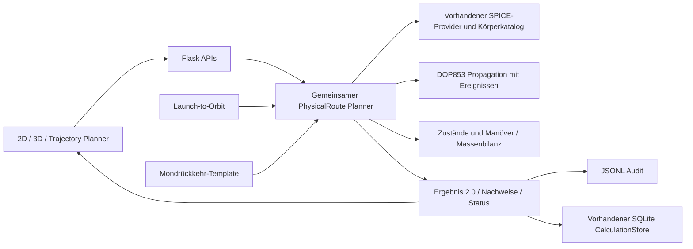

# Bahnberechnung und Routenplanung – Reparatur und Nachweise

Stand: 2. Oktober 2026. Projekt: `C:\Users\marti\PycharmProjects\Solar-System`.
Die separate SGP4-CLI in `H:\OneDrive\Dokumente\Solar` ist nicht die Webanwendung.

## Auftrag und Abgrenzung

Freigegeben ist die Korrektur der gesamten Routen-Rechenkette, einschließlich
zielunabhängiger Planung, Erde–Mond–Mondorbit–Erde und Startplatz–Parkorbit.
Die drei beigefügten Arbeitsanweisungen sind fachliche Anforderungen innerhalb
dieses Auftrags. Sie ersetzen keine Fahrzeugdaten, Sicherheitsfreigaben oder
physikalischen Nachweise.

Eine Route gilt nur innerhalb des ausdrücklich angegebenen Modells als gültig.
Nicht jede Kombination aus Startzeit, Ziel, Flugzeit, Orbit und Treibstoff besitzt
eine Lösung. Ein nicht gefundenes Ergebnis ist kein Beweis der Unmöglichkeit.
Aus einer ansprechenden Kurve darf keine durchführbare Mission abgeleitet werden.

## Befunde und Änderungen

| Früheres Problem | Verhalten der neuen Rechenkette | Codebeleg |
|---|---|---|
| Unterschiedliche Spezialpfade und synthetische Passagen | Öffentliche Route-APIs delegieren an den gemeinsamen Planner | `planner/trajectory_planner.py::calculate_section_route`, `planner/multi_route_planner.py::simulate_route_sections`, `planner/route_planner.py::_common_solar_request`, `main.py::_direct_lambert_route` |
| Punktwolken ohne vollständige Geschwindigkeit und Zeitpunkt | Jeder Zustand trägt r, v, UTC, Frame, Zentrum und vorhandene Massen | `solver/orbital.py::state`, `PhysicalRoute.snapshot` |
| Auf Mitternacht gekürzte Startzeit | Zeitzonen werden nach UTC normalisiert; Uhrzeiten bleiben erhalten | `solver/orbital.py::utc`, `solver/trajectory.py::_mission_epoch_days` |
| Körpermittelpunkt/Baryzentrum vertauscht | SPICE-Mittelpunkt und Intervallabdeckung werden geprüft; Näherungen sind Vorschauen | `solver/ephemeris.py::body_quality`, `PhysicalRoute.to_result` |
| Kreisbahn als Grafik angefügt | Einfangimpuls und Bewegungsgleichung erzeugen einen gebundenen Orbit; Umläufe werden aus den Zuständen gemessen | `PhysicalRoute.encounter`, `solver/orbital.py::elements` |
| Eintritt und Austritt auf Zielpunkte verschoben | Propagation liefert den wirklichen Endzustand; Residuen sind Teil des Ergebnisses | `PhysicalRoute.transfer`, `solver/nbody_propagation.py::propagate_conic` |
| Kosten nur für das Sonnenmanöver | Gesamtkosten enthalten alle Abflug-, Korrektur-, Einfang-, Rückkehr- und Richtungsimpulse sowie den endlichen Startaufstieg | `PhysicalRoute.burn`, `PhysicalRoute.to_result` |
| Kosten ohne Fahrzeugnachweis | Raketengleichung, Resttreibstoff und gekoppelte Massen prüfen jede Zündung | `solver/orbital.py::maneuver`, `PhysicalRoute.__init__` |
| Solar-Austrittsgeschwindigkeit als v∞ behandelt | Die geforderte Geschwindigkeit wird am tatsächlichen ausgehenden 1-AE-Ereignis gemessen | `PhysicalRoute.solar_passage`, `tests/test_route_contracts.py` |
| Getrennt neu simulierte Missionsanzeige | Altformat-Export übernimmt genau die r/v/Massen der berechneten Route | `planner/route_planner.py::_route_mission_payload` |
| Alte Optimiererfelder als Vollprüfung | Der Altoptimierer bewertet die Nachweise des gemeinsamen Planners | `planner/mission_optimizer.py::_physical_route_reasons` |
| Historische Kurven wieder als bestätigt verwendet | Schema, Build und Nachweise werden geprüft; die Oberfläche berechnet Wiederherstellungen erneut | `services/calculation_store.py::get_variant`, `TwoDView.tsx` |
| Berechnung und Planetendarstellung mit anderer Bahnphase | Ereigniszustände der Körper werden mitgeliefert und für die Anzeige verwendet | `bodyEphemerides.ts`, `orbitalMath.ts`, `moonMath.ts` |

## Architektur und Ablauf

1. Eingaben, Zieltyp, Zeitfenster und Grenzen normalisieren.
2. Startzustand aus explizitem Zustandsvektor, spezifizierter Parkbahn oder
   endlichem Startaufstieg bilden. Bei freier Parkbahn werden Phase und Ebene
   als Entwurfsgrößen aus dem ersten Ziel bestimmt; explizite Werte bleiben fest.
3. Für jeden Wegpunkt den tatsächlichen vorherigen Endzustand verwenden.
4. Lambert-Lösungen des vorhandenen Solvers liefern Transferkandidaten.
   Zielhöhe und B-Ebenenwinkel bestimmen den Einflug; lokale Dynamik erzeugt
   Annäherung, gebundenen Orbit oder passiven Vorbeiflug.
5. Optional korrigiert numerisches Shooting den Abflug unter kontinuierlicher
   Sonnen-, Planeten- und großer Mondgravitation.
6. Jeden Impuls und jeden Massenverlust einzeln protokollieren. Grenzen und
   Treibstoffnachweise werden mit dem gesamten Verlauf abgeglichen.
7. Kontinuität, Körperkontakt, Zielbedingung, Datenqualität und Ressourcen prüfen.
8. Ergebnis, Guide, Audit und Speicherung verwenden dieselbe Zustandskette.

Der Standard ist eine ereignisaufgelöste Patched-Conics-Rechnung mit idealen
Impulsen und geometrischen SPICE-Ephemeriden. Das ist ein Entwurfsmodell.
`simulation.highFidelityNBody=true` aktiviert das stärkere Kraftmodell und die
Transferkorrektur. Ein nicht erfülltes lokales Orbitziel wird dadurch nicht
nachträglich auf Sollwerte gesetzt.

Die alten privaten `_legacy_*`-Implementierungen sind zur Nachvollziehbarkeit
noch im Repository. Sie sind nicht die öffentlichen Berechnungseinstiege.
Schnelle Konstellations-, Linien- und ML-Bewertungen ordnen Kandidaten und
stellen keinen physikalischen Nachweis dar.

## Daten und Schnittstellen

| Schnittstelle | Zweck |
|---|---|
| `POST /api/trajectory/plan` | Generische Körper-, Orbit-, Flyby-, Richtungs-, Zonen-, Grenz- und Zustandsziele |
| `POST /api/route/simulate` | Bestehende Abschnittsplanung über denselben Planner |
| `GET /api/launch/sites` | Gepflegte Startplatzdaten |
| `POST /api/launch/plan` | Konkretes Stufenfahrzeug bis zum gemessenen Parkorbit |
| `GET /healthz` | Laufender Rechenstand und Buildkennung |

Zustände sind heliozentrisch in `ECLIPJ2000`, Position in km und Geschwindigkeit
in km/s. ECI/J2000-Eingaben werden für **beide** Vektoren transformiert.
Bei einem Körper als Bezugspunkt werden dessen Position **und** Geschwindigkeit
addiert. Zeitstempel sind ISO-UTC; historische reine Datumswerte bedeuten
UTC-Mitternacht. Der Startaufstieg rechnet zunächst im Erd-J2000-System und
übergibt einen vollständig transformierten Zustand.

Ergebnisse tragen `schemaVersion: "2.0"` und `calculationBuild`. Segmente
besitzen `startState` und `endState`; Manöver besitzen Vorher-/Nachher-Zustand,
Δv-Vektor, Δv-Betrag und Treibstoffbedarf. Nicht ausführbare Zündungen bleiben
als geplante Entwürfe sichtbar und bestätigen keine Mission.

SQLite-Schema 5 erweitert die bestehende Trajektorientabelle um `state_json`.
Geschwindigkeiten und zusätzliche Zustandsdaten werden verlustfrei gespeichert.
Alle tatsächlichen Manöver werden in der bestehenden Δv-Tabelle abgelegt;
alte aggregierte Kosten werden bei modernen Ergebnissen nicht zusätzlich addiert.
Alte Daten werden nicht gelöscht. Ein früherer Build erfordert Neuberechnung.

| Status | Aussage |
|---|---|
| `model_valid` | Numerisch gültiger Entwurf im genannten Modell, ohne konfiguriertes Fahrzeug |
| `valid` | Modellnachweise und konfigurierte Fahrzeugressourcen erfüllt |
| `infeasible` | Geometrie kann vorliegen, aber ein Budget oder eine Ressource reicht nicht |
| `data_unavailable` | Ephemeride, exakter Mittelpunkt oder physikalische Körperdaten fehlen |
| `no_solution_found` / API-Ablehnung | Im untersuchten Raum keine bestätigte Lösung; kein Unmöglichkeitsbeweis |

`flightReady` bezeichnet nur die Modell- und Ressourcenprüfung in der Anwendung,
keine betriebliche Flugfreigabe.

## Mondrückkehr

`missionTemplate: "earth_moon_orbit_return"` baut die Route aus den gemeinsamen
Phasen auf: Erd-Parkorbit → TLI → Mondannäherung → LOI → gebundener Mondorbit
mit mindestens einem gemessenen Umlauf → TEI → Erd-Rückkehr.

Rückkehrmodi sind `earth_reentry`, `earth_orbit_capture` und `flyby_return`.
Reentry prüft Eintrittshöhe und Flugbahnwinkel am Interface; ein atmosphärischer
Abstieg, Aerothermik und eine Landung werden damit nicht simuliert.
TLI-, LOI- und TEI-Kosten werden gesondert und zusätzlich im Gesamtbudget geführt.
Eine ballistische Free-Return-Bahn wird nicht als Mondorbit-Mission ausgegeben.

## Startplatz bis Parkorbit

`planner/launch_to_orbit.py` verwendet WGS84-Koordinaten und SPICE-
Zustandstransformation einschließlich Erdrotation. DOP853 integriert r, v und
Masse mit endlichem Schub, Stufen-Isp, Treibstofffluss, Schwerkraft und
Widerstand in einer rotierenden exponentiellen Atmosphäre.

Stufentrennung und optionaler Verkleidungsabwurf sind echte Massenereignisse.
Für eine Verkleidung müssen Mindesthöhe und maximale dynamische Belastung
explizit angegeben werden. Ein Zielorbit erfordert passende Peri-/Apoapsis,
gebundene Energie, Inklination und gegebenenfalls RAAN/Exzentrizität.
Eine passende Flughöhe allein reicht nicht.

Die JSON-Referenz in `tests/fixtures/launch_reference.json` ist ein
**Entwurfsfahrzeug für Regressionstests**, keine validierte reale Rakete.
Startplatz-Korridore werden nur geprüft, wenn echte Grenzen gepflegt sind.

## Validierung und Teständerungen

Maschinenlesbare Nachweise liegen in `logs/trajectory-repair/`:

- `python-suite.json`: kompletter Python-Testlauf im isolierten Datenspeicher.
- `target-matrix.json`: sieben andere Planeten, zwölf große Monde und ein
  korrigierter N-Körper-Transfer Erde–Mars. Phobos wird mit 0,05 Tagen geprüft;
  der zuvor untersuchte Dreitagestransfer kollidierte mit Mars.
- `typescript-build.json`, `web-tests.json`: Build und vorhandene Webprüfungen.
- `live-functional.json`: Version, Erreichbarkeit und Funktionsprüfung online.
- `workload.json`: Revisionsschutz, Änderungen und Abschlussnachweise.

Neue Referenztests prüfen die analytische Kreisbahn und Erhaltung von Energie/
Drehimpuls, radialen Grenzübertritt gegen unabhängige Quadratur, UTC und
Vektortransformationen, unabhängige Raketengleichung, echte gebundene Orbits,
Mondrückkehr, Startrotation, Stufen-/Verkleidungsmasse, identische Übergaben,
fehlende Ephemeriden und unzureichende Ressourcen.

Einige alte Tests erwarteten künstliche Kreise, gerade interstellare Strahlen
oder feste Segmentnamen. Diese Erwartungen wurden durch Energie-, Umlauf-,
Kontinuitäts- und Budgetnachweise ersetzt. Normalisierung, Reihenfolge,
API-Verträge und vorhandene Speicherprüfungen bleiben abgedeckt. Fehlende
Nachweise gelten in der Oberflächenvalidierung nicht länger als bestanden.

Der vollständige Python-Lauf umfasst 125 bestandene Tests; die Zielmatrix 20
bestandene Fälle. Acht Webprüfungen schließen die gemeinsame Ergebnisübergabe,
den Erhalt von r/v/Masse/Treibstoff und eine unabhängige Hermite-Referenz ein.
Die spätere Einbindung der Oberfläche ändert keine Physikdateien; der
Release-Nachweis kombiniert den vollständigen Backendlauf mit dem finalen
Oberflächen-Build und der erneuten sichtbaren 2D-/3D-Prüfung.

Die Bedienprüfung ergänzte die Übernahme von UTC-Eingaben beim Verlassen des
Feldes. Die Mondvorlage blendet ungenutzte generische Zielfelder aus. Die 3D-Anzeige
berechnet die Eintrittsbreite aus der tatsächlichen Richtung, wenn das historische
Anzeigefeld fehlt; sie zeigt die belegten Passagekosten statt eines erfundenen
Einschusses. Modellgültigkeit allein aktiviert keine Fahrzeugfreigabe.

Die Zielmatrix belegt diese konkreten Eingaben, keine vollständige Prüfung aller
Zeitpunkte und aller katalogisierten Monde.

## Modellgrenzen und offene Fragen

1. **Globales Optimum:** Die Rastersuche untersucht begrenzte Datums- und
   Lambert-Kandidaten. `exhaustiveWithinGrid=false` kennzeichnet die Beschränkung.
   Beliebige Mehrfachumläufe und eine globale Mehrbein-Optimierung sind nicht bewiesen.
2. **Kleine Monde:** Ohne belastbares GM/Radius und exakte Ephemeride bleibt
   ein Ziel eine Vorschau oder wird abgelehnt. Instabile Orbits, etwa 100 km über
   Phobos, werden an einer konservativen Hill-Grenze abgewiesen.
3. **Langzeit- und Nahkörperdynamik:** Patched Conics ersetzt keine dauerhafte
   Orbitstabilitätsprüfung. Oblateness/J2, nicht sphärische Gravitation,
   Relativität, Strahlungsdruck und reale Navigation sind nicht durchgängig gelöst.
4. **Aufstieg:** Wind, variable reale Aerodynamik, Gimbalgrenzen und zugelassene
   Sicherheitszonen benötigen echte Fahrzeug-/Standortdaten. Der Verkleidungsabwurf
   prüft Höhe und Max-Q; eine separate thermische Abwurfberechnung fehlt.
5. **Spezielle Randbedingungen:** Ein normierter Scheibenradius ist kein
   physikalischer Aimpoint. Nicht gelöste explizite Eintritts-/Austrittsbedingungen
   erhalten keine bestätigte Route. Exakte antipodale Lambert-Geometrien können
   abgelehnt werden; explizite Startzustände werden nicht heimlich verändert.
6. **Kontinuierliche Antriebe:** Das Impuls-Routenmodell bewertet keine frei
   steuerbare E-Sail-/Ionen-Trajektorie. Die separate Missionssimulation bleibt
   ein ausgewiesenes anderes Modell und verwendet den gemeinsamen physischen
   Abflug. Missions-Exports einer geplanten Route simulieren keinen zweiten Verlauf.
7. **Darstellung:** Körperzustände an berechneten Ereignissen stammen aus SPICE.
   Zwischenwerte verwenden Hermite-Interpolation nur für die Anzeige; außerhalb
   der mitgelieferten Zeitreihe bleibt die Katalogdarstellung näherungsweise.
   Monde und Radien sind zur Sichtbarkeit teilweise vergrößert, keine Messgrafik.
8. **Betrieb:** Die HTTPS-Adresse verwendet weiterhin den vorhandenen Sites-
   Proxy und lokalen Python-Server durch einen temporären Tunnel. Ihre Verfügbarkeit
   hängt vom laufenden Rechner, Server und Tunnel ab.

## Primärquellen

- [NAIF Satelliten-SPKs und Prüfsummen](https://naif.jpl.nasa.gov/pub/naif/generic_kernels/spk/satellites/)
- [NAIF sxform: vollständige Zustandstransformation](https://naif.jpl.nasa.gov/pub/naif/toolkit_docs/C/cspice/sxform_c.html)
- [JPL Horizons: Systeme und Zeiten](https://ssd.jpl.nasa.gov/horizons/manual.html)
- [JPL Satelliten-Bahnparameter: mittlere Elemente, keine Präzisionszustände](https://ssd.jpl.nasa.gov/sats/elem/)
- [NASA Apollo-Daten für Startplatzkoordinaten](https://www.nasa.gov/wp-content/uploads/2023/04/sp-4029.pdf)

Die heruntergeladenen offiziellen Kerneldateien werden in `kernels/manifest.json`
mit Herkunft, Größe und SHA-256 dokumentiert. Der Buildfingerprint enthält das
Manifest sowie die relevanten Rechen-, Modell-, API- und Oberflächendateien.

## KI-Abschaltung auf Nutzerwunsch

`SOLAR_SYSTEM_AI_DISABLED=1` in `.env.local` sperrt die gemeinsame
Transportauswahl in `ai/interaction_agent.py::_provider`. Die Statusabfrage
meldet die Abschaltung, ohne den Modellserver aufzurufen. Lokaler und online
verwendeter Solar-Server wurden mit dieser Sperre neu geladen. Ollama und der
geladene Modellprozess wurden beendet; die Rechenfunktionen laufen weiter.
Die 41 KI-Vertragstests einschließlich zweier Sperrtests bestehen mit gemocktem
Transport. Für eine bewusste spätere Reaktivierung kann der Schalter auf 0
gesetzt werden; ein Modellserver wird dadurch nicht automatisch gestartet.
